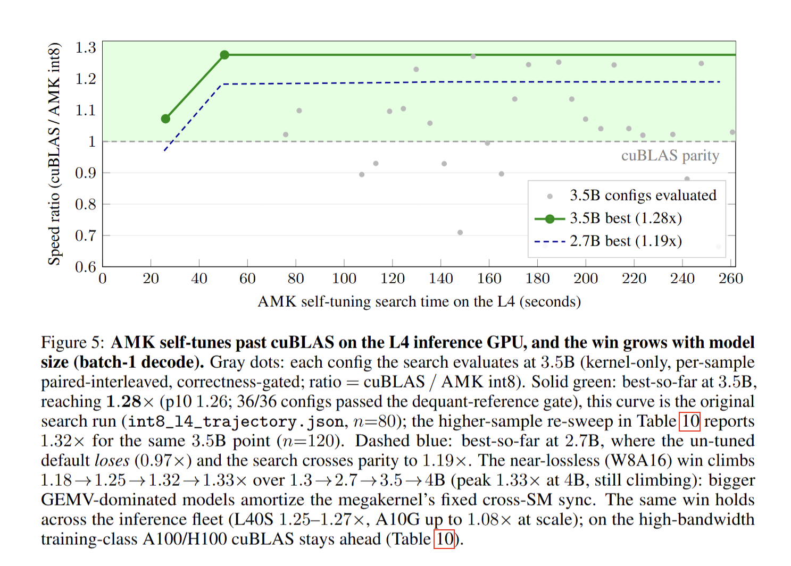

<p align="center">
  
</p>

# AutoMegaKernel (AMK)

> **A general agent harness for GPU megakernel synthesis.** A coding agent (Claude Code / Codex)
> drives AMK to compile a model into one **provably-correct**, self-retargeting megakernel, the
> whole forward pass fused into a single persistent launch, then self-tunes it, and it gets better
> every time it runs.

**Repo:** https://github.com/RightNow-AI/AutoMegaKernel &nbsp;·&nbsp; **License:** MIT &nbsp;·&nbsp; the open research harness ([Enterprise / Forge](#enterprise))

```bash
amk compile <model> --gpu <arch> --regime single-stream
# imports -> lowers -> validates (deadlock + race free) -> verifies vs eager -> builds the GPU
# megakernel -> measures it against the HBM roofline -> emits a correct megakernel + report
```

AMK is the sibling of [AutoKernel](https://github.com/RightNow-AI/autokernel): AutoKernel
auto-generates the single best *kernel*; AMK auto-generates the single best whole-model
*megakernel*. It inherits AutoKernel's autoresearch loop (propose → fixed eval → keep/revert, for
hours, unattended) and adds a new search axis: **the schedule**.

> **Coverage today:** the HuggingFace Llama family on CUDA (sm\_75 to sm\_120).
> **Roadmap (future work):** generalizing the importer and backends to more architectures,
> languages, and targets. The harness (validator, oracle, search loop) is not model-specific; the
> agent is what supplies that generality, and broadening it is the central direction of the work.

---

## Results: int8 beats cuBLAS across the inference fleet

AMK's auto-tuned **int8** (W8A16, near-lossless) megakernel **beats CUDA-graphed cuBLAS bf16** at
batch-1 decode across NVIDIA's datacenter **inference-class** GPUs, found autonomously by AMK's own
search and correctness-gated (argmax-exact). Ratio = cuBLAS / AMK, so **> 1 means AMK is faster.**

| GPU | Class | int8 vs cuBLAS bf16 (best) | Verdict |
|---|---|---:|---|
| **L4** (sm_89, 300 GB/s) | inference | **1.18× → 1.33×** (1.3B→4B) | ✅ wins, grows with size |
| **L40S** (sm_89, 864 GB/s) | inference flagship | **1.25× → 1.27×** (4B→6.7B) | ✅ wins |
| **A10G** (sm_86, 600 GB/s) | inference | **1.04× → 1.08×** (≥3.5B) | ✅ wins at scale |
| **RTX 5090** (sm_120) | consumer (local) | **1.19× → 1.23×** | ✅ wins |
| A100 (sm_80, 1.4 TB/s) | training | 0.79× → 0.55× (1.3B→13B) | ✗ trails (declines w/ size) |
| H100 (sm_90, 3.1 TB/s) | training | 0.72× → 0.60× | ✗ trails |

Inference / datacenter GPUs measured on **Modal** (reproducible; file-backed in
`paper/results/int8_scale_*.json`). RTX 5090 measured **locally** (`int8_search_multisize.json`;
Modal has no RTX 5090 silicon, so it is not in the Modal sweep).

**What governs the win is the inference-class vs. training-class regime, not bandwidth ordering:**
the 864 GB/s L40S wins by *more* than the 600 GB/s A10G. AMK reads ~half the weight bytes (int8), and
that advantage has to overcome a *fixed* per-tile cross-SM sync; larger, GEMV-dominated models amortize
that fixed cost. The training-class A100/H100 never cross (the ratio *declines* with size, the
fingerprint of the sync deficit; a `cp.async` int8-GEMV probe even regressed to 0.82× on A100,
confirming cross-SM sync, not load latency, is the binder). The win is batch-1, pos-0 / low-context.
Full data and analysis: [`DATACENTER_RESULTS.md`](DATACENTER_RESULTS.md).

### The equal-precision gap (stated plainly)

On the **like-for-like bf16** path AMK *trails* cuBLAS. On a 622.9 MB model the bf16 kernel runs at
**~1.38 ms/token, ~1.24× slower** than CUDA-graphed cuBLAS; the optimized bf16 GEMV sustains **~451 GB/s
= ~51% of spec / ~63% of measured HBM peak** (cuBLAS ceiling ~90%). The int8 win therefore comes from
streaming fewer bytes, not from a faster kernel; the int8 kernel on the same model is ~1.22 ms/token
(~1.09× slower than cuBLAS bf16). The remaining lever is a bandwidth-saturating `cp.async` GEMV with
coarser cross-SM sync, a kernel-quality push rather than a redesign, and the correctness-bearing
architecture that makes that safe and automatic is already in place. We do **not** beat cuBLAS/vLLM at
bf16 batch-1, and we say so. Reproduce (GPU): `uv run pytest tests/test_cuda_perf.py`; the 10-minute
self-improving run: `uv run python amk_cli.py autoresearch small --gpu rtx5090 --minutes 10`.

---

## What's built and measured

- **The whole forward pass runs as one cooperative kernel launch.** The persistent megakernel (one
  threadblock per SM, counter-synchronized) executes a full Llama-style decode and matches eager
  PyTorch **and** the CPU reference VM to ~1e-7 (fp32) / bf16 tolerance.
- **Self-retargeting, measured on three architectures.** The *same source* built and ran a correct
  megakernel on **sm_120 (RTX 5090)**, **sm_80 (A100)**, and **sm_90 (H100)**, with the nvcc gencode
  derived from the live device (the H100 ran a 3 GB / 3202-task Llama-1B-shaped decode correctly).
  See [`DATACENTER_RESULTS.md`](DATACENTER_RESULTS.md).
- **Multi-token generation that matches eager.** AMK greedily decodes a *sequence*, threading a
  persistent KV cache across steps; the generated token ids are identical to eager greedy decode.
  Reproduce: `uv run amk generate toy --gpu rtx5090 --prompt-ids "1,2,3" --max-tokens 32 --verify`.
- **A real trained checkpoint, end-to-end.** AMK imports `HuggingFaceTB/SmolLM2-135M` (real weights +
  tokenizer) and reproduces HuggingFace's own greedy `generate` token-for-token. Reproduce:
  `uv run python examples/run_hf_model.py` (also `tests/test_hf_checkpoint.py`).
- **A statically-checked schedule validator.** Across 7,160 adversarial schedules the validator had
  **zero false-accepts**; an unsafe agent-proposed schedule is `REJECTED` at validation time instead of
  hanging the GPU.
- **A native coding-agent harness.** Drivable by any coding agent (Claude Code / Codex) through one
  structured edit surface: MCP server + Claude Code skill/commands/subagent/workflow + Codex
  `AGENTS.md`. See [`docs/AGENT_HARNESS.md`](docs/AGENT_HARNESS.md) and [`HARNESS.md`](HARNESS.md).
- **A 10-minute unattended autoresearch run** self-improves the megakernel **1.47×** over its own
  starting schedule.
- **98 tests green** (`uv run pytest`): 78 pass on CPU; 20 CUDA tests auto-skip without a GPU.

---

## Why a megakernel

Single-stream decode is **bandwidth-bound**: each token must stream the whole weight set through the
SMs once. The theoretical floor is `weights_bytes / HBM_bandwidth`. A normal PyTorch / cuBLAS execution
launches *one kernel per op* and round-trips activations through HBM between every op, paying launch
latency and a memory bubble dozens of times per layer.

A **megakernel** launches **once**, keeps the persistent threadblocks resident on every SM, and walks
the model's dependency graph in-place: activations live in on-chip pages, the next layer's weights are
prefetched while the current layer computes, and there is no kernel-launch bubble between ops. The win
regime is **single-stream / low-batch decode latency**: voice, realtime, agentic loops. We do **not**
claim to beat throughput-optimized serving at high batch; that is compute-bound and not this fight.

## How it works

Generation is **confined inside a verified structure**, so correctness is a property of the
architecture, not of the model output.

### Four layers

| Layer | Role | Trust model |
|------:|------|-------------|
| **0: VM** ([`vm/`](vm/)) | Persistent kernel: per-SM scheduler loop, page-based scratchpad, counter-based sync. Launched once, runs the whole forward pass. | Trusted base. Hand-written, exhaustively verified, **frozen** per arch. |
| **1: Instructions** ([`instructions/`](instructions/)) | ABI-conformant micro-kernels (gemv/gemm tile, attention tile, RMSNorm, RoPE, SwiGLU, dequant…). Triton for iteration, CUDA for max perf. | Each is correctness-checked vs its reference op **in isolation** before it can enter a megakernel. |
| **2: Scheduler** ([`schedule/`](schedule/)) | `HF model → graph IR → tiled task-DAG → instruction stream + page allocation`. Cost-model explore + on-hardware exploit. | The research core. Proposes points in a search space the VM realizes **safely**. |
| **3: Dynamism** ([`dynamism/`](dynamism/)) | Shape-parametric tiles + in-kernel dispatch: continuous batching, dynamic shapes, MoE routing. | The relevance gate for real serving. (Roadmap: placeholder package.) |

### Deadlock-freedom by construction

A forward pass is a **DAG**. Producers only *increment* counters; consumers only *wait* on
statically-known thresholds; execution is a topological walk with monotonic counters: no locks, no
arbitrary signalling. **The VM refuses to load any schedule that is not a valid DAG**: an invalid
schedule becomes a clean `REJECTED` at validation time instead of a hung GPU. This is what makes
auto-generated schedules safe to run unattended.

### Two autoresearch loops

- **Loop 1, Instruction optimization** (this *is* AutoKernel): edit one ABI-conformant micro-kernel,
  isolated correctness-then-latency eval (~seconds), keep/revert. A wrong instruction fails its own
  unit test; no persistent kernel, no hang.
- **Loop 2, Schedule optimization** (the new loop): the agent's edit surface is the **schedule IR**, a
  structured object `{tiling, fusion_grouping, sm_assignment, pipelining_depth, page_allocation}` plus
  kernel knobs, *not* megakernel code. The frozen VM deterministically lowers it; every proposal is
  statically DAG-validated **before launch**. The full contract is in [`HARNESS.md`](HARNESS.md).

## The four properties (the product spec)

1. **Generality**: one command compiles a model into a verified megakernel with zero per-model
   hand-written CUDA (today: the HF Llama family; broadening coverage is the roadmap).
2. **Self-retargeting**: when new silicon ships, AMK retargets in *days* via search + on-hardware
   verification. Already measured across sm_120 / sm_80 / sm_90. This is the moat.
3. **A standard IR**: AMK owns the canonical megakernel IR: the SM-level task-DAG, the instruction
   ABI, the schedule format. See [`docs/IR_SPEC.md`](docs/IR_SPEC.md), [`schedule/ir.py`](schedule/ir.py), [`vm/abi.h`](vm/abi.h).
4. **A data flywheel**: every run logs `(model, gpu, schedule, instruction, measured result)`; that
   corpus trains a learned prior so every future run starts smarter.

## Native coding-agent integration

AMK exposes the verified loop substrate *natively* to coding agents, with the same behavior and the
same honesty rules. The single guide is [`docs/AGENT_HARNESS.md`](docs/AGENT_HARNESS.md).

- **MCP server** ([`amk_mcp.py`](amk_mcp.py)): `amk_doctor` / `amk_propose` / `amk_eval` / `amk_loop` /
  `amk_autoresearch` / `amk_orchestrate_*`. Enable with `uv sync --extra agent`; register via
  `.mcp.json` (Claude Code) or `~/.codex/config.toml` (Codex).
- **Claude Code**: the `megakernel-optimization` skill; the `/amk-optimize`, `/amk-autoresearch`,
  `/amk-compile` slash commands; the `amk-megakernel-optimizer` subagent; a workflow and a goal under
  `.claude/`.
- **Codex**: `AGENTS.md` + the same MCP server.

## Quickstart

AMK installs as a real package (hatchling) and exposes a real `amk` console command. `uv sync`
provisions the full environment (torch cu128, numpy, transformers for the HF importer, ninja for the
CUDA JIT build, pytest); **`uv` is the recommended path.** With pip:
`pip install "automegakernel[models,cuda]"`, note the cu128 torch pin only applies under `uv`, so pip
users on Blackwell/sm_120 (or any specific CUDA build) should install the matching torch wheel first,
e.g. `pip install torch --index-url https://download.pytorch.org/whl/cu128`.

```bash
uv sync                              # provision the env + install the `amk` command (editable)

# --- No GPU required (works on a fresh CPU-only machine) ---
uv run pytest                        # full suite (98 tests; 78 on CPU, 20 CUDA auto-skip without a GPU)
amk doctor                           # environment + GPU + nvcc + registered targets
amk eval toy --device cpu            # one structured correctness verdict on the CPU reference VM

# --- Requires a CUDA GPU + nvcc ---
amk compile toy --gpu rtx5090 --regime single-stream                            # model -> verified megakernel + report
amk generate toy --gpu rtx5090 --prompt-ids "1,2,3" --max-tokens 32 --verify    # multi-token decode == eager
amk eval toy --gpu rtx5090                                                       # correctness + measured-GPU latency
```

Every subcommand is also runnable as `uv run python amk_cli.py <cmd> ...` (identical behavior). A real
trained checkpoint runs end-to-end via `uv run python examples/run_hf_model.py`.

## Honesty rules (enforced by the harness, not just stated)

- **Never a latency number without its paired correctness result.** `eval/bench.py` refuses to emit a
  latency without a verdict from `eval/oracle.py`.
- Correctness = full-model logit equivalence within tolerance **plus** generated-token agreement vs
  eager PyTorch over a sequence.
- Always report **distance to the `weights / HBM_bandwidth` roofline** ([`eval/roofline.py`](eval/roofline.py)).
- Measured numbers are produced on the hardware named in the flywheel corpus / `results.tsv`; the
  datacenter numbers in [`DATACENTER_RESULTS.md`](DATACENTER_RESULTS.md) *are* measured. We do not
  transcribe numbers we did not measure.
- We are **near-bandwidth-bound nowhere yet** on the bf16 path, and we say so. The honest current
  claims are: the int8 inference-fleet cuBLAS win, generality, self-retargeting, trust
  (deadlock + race free by construction), and honest distance-to-roofline.

## Repo layout

```
vm/            Layer 0, trusted megakernel VM (CUDA) + CPU reference simulator + verify
instructions/  Layer 1, ABI-conformant micro-kernels (Triton + CUDA) + generator + verify
schedule/      Layer 2, graph import, lowering, the STANDARD IR, cost model, search
dynamism/      Layer 3, continuous batching, dynamic shapes, MoE (roadmap placeholder)
eval/          oracle (logit equivalence) · bench (latency) · baselines · roofline
amk_cli.py     the `amk` console command (doctor/compile/generate/eval/propose/loop/...)
compile.py     THE PRODUCT: amk compile <hf-model> --gpu <arch>
generate.py    autoregressive multi-token decode (KV cache threaded across steps)
harness.py     the coding-agent integration surface (Loop 2, schedule search)
examples/      run_hf_model.py, a real HF checkpoint end-to-end (SmolLM2-135M)
docs/          IR_SPEC.md (the standard IR) · AGENT_HARNESS.md (agent integration)
HARNESS.md     the coding-agent harness contract
DATACENTER_RESULTS.md  measured inference-fleet + sm_80/sm_90 self-retargeting results
program.md     the autonomous-operation brain (run AMK unattended)
models/        self-contained test models (small dense -> MoE)
```

## Status

The correctness-bearing core, the GPU megakernel, self-retargeting, multi-token generation, the
real-checkpoint path, and the agent harness are all built and measured. The active push is
kernel-quality perf toward the roofline (see [the gap](#the-equal-precision-gap-stated-plainly)). See
[`program.md`](program.md) for the roadmap and the autonomous-loop discipline; the IR
([`schedule/ir.py`](schedule/ir.py), [`docs/IR_SPEC.md`](docs/IR_SPEC.md)) and the instruction ABI
([`vm/abi.h`](vm/abi.h)) are the two stable contracts everything is built against.

## License

MIT © 2026 RightNow AI

## Enterprise

AutoMegaKernel is our open research harness. For production and enterprise needs we are building
**Forge**, an internal advanced kernel generator for enterprises. For enterprise requests, contact
**[jaber@runinfra.ai](mailto:jaber@runinfra.ai)**.
